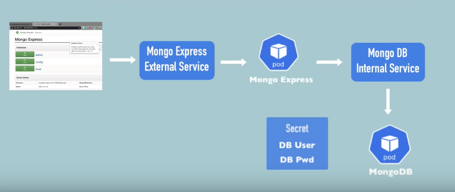

# docker commands

- `docker version` : to see the version of docker installed on the machine
- `Dokerfile` : has deployment instructions
- `docker build -t hello-docker .` : to build the image from Dockerfile, with `t`erminal and name. `.` means the `Dockerfile` is in the current directory from where we are running the command from
- `docker images` OR `docker image ls` : to list down all the images present on the machine
- `docker run hello-docker` : to run the docker image
- `docker pull ubuntu` : will pull the image to your machine
- `docker run ubuntu` : will pull the image if not present on the machine and run the image
- `docker ps` : lists running docker containers (processes)
- `docker ps -a` : lists all docker conainers, including stopped containers 
- `docker run -it ubuntu`: interactive terminal

---
## concepts

- what is image : template for creating environment which has your app 
- what is container : container is a running instance of an image

---
## commands
- `docker container ls` : to list running containers
- `docker ps` : same like above
- `docker start <conatiner id>` : to start the container / id or name can be used
- `docker stop <conatiner id>` : to stop the container

### exposing ports with docker

- `docker run -d -p 8080:80 nginx:latest`: the nginx container exposes the port 80, we are mapping the port 8080 of the localhost to port 80 of the container, so that we can access the application running in the container at localhost:8080

### mapping more than one host port to the exposed port from container

- `docker run -d -p 8080:80 -p 3000:80 nginx:latest`

## to delete a container
- `docker rm <container_name> OR <container_id>` : to delete a container
- `docker rm $(docker ps -aq)` : to delete all containers, -q returns the ids only
- `docker rm -f $(docker ps -aq)` : to delete all containers, -f force deletes the container


## how to name containers

- `docker run --name website -d -p 3000:80 nginx:latest`

## docker volumes
Allows sharing of data between host and container and also between containers

what we are doing here is we will be mounting the volume and adding some html pages to change the default welcome page of the nginx container

/usr/share/nginx/html/index.html => contains the welcome page on the nginx container

`docker run --name website -v /home/rohit/workspace/learn/docker/www:/usr/share/nginx/html:ro -d -p 3000:80 nginx`

`docker run --name website -v $(pwd):/usr/share/nginx/html:ro -d -p 3000:80 nginx`

-v <source from host>:<target from container>:<readonly> (if ro is removed then we can exec into the volume and add more files)


--- 
`docker exec -it <container_name>  bash` : execute bash command in the container

if we add a new file in the target directory of the mounted volume then we can see it in the host source volume also

## sharing volumes between containers

`docker run --name website-two -d -p 3001:80 --volumes-from website nginx`

this command will attach volume from website to website-two so that both the websites can share the same volume

## Use Dockerfile to build images
dockerfile reference: https://docs.docker.com/engine/reference/builder/ 

Dockerfile is a series of steps that defines how an image is built

Example:
``` dockerfile
    # Base image
    FROM node:alpine
    # copy the files to be running when the image starts
    COPY . /app
    # current working directory
    WORKDIR /app
    # command to start the application, app.js is inside the workdir
    CMD node app.js
```

### one more example
```dockerfile
# baseimage
FROM nginx:latest
# Add the content of www folder to the target folder in the container
ADD ./www /usr/share/nginx/html
```

### command to build image from dockerfile

`docker build --tag <image-name>:<tag-name> .`  : . => current dir
`docker build --tag website:latest .`

because we have added the content of ./www folder to the target folder in the container we dont have to mount volume, as all the needed data is available in the image

### similarly we can build and run userservice api also
`docker build --tag user-service-api:latest .`
`docker run --name user-service-api -d -p 3001:3001 user-service-api`

## .dockerignore file

same like gitignore

- in case of express project we dont want to copy the node_modules to the image while building the image
- we specify all such things to ignore in the .dockerignore file

## caching and layers

caching can be used to avoid rebuilding all the layers and build only those layers which has changes

e.g. if only source code is changed then build only source code again

## improving image sizes

by pulling alpine images

normal node is around 908Mb alpine is 117 MB

`docker pull node:lts-alpine`

## how to tag

`docker build --tag user-service-api:latest .`
`docker tag user-service-api:latest user-service-api:1`  : this one creates a new tag 

## Docker registry

go to docker hub and create a repository  
it will give command like below  
    `docker push laxman1129/user-service-api:v1`  

tag images in the local with the repository name and version
    `docker tag user-service-api:v1 laxman1129/user-service-api:v1`

execute `docker push laxman1129/user-service-api:v1`


## inspecting container

to fully inspect the container  
NOTE: works on running as well as stopped containers

`docker inspect <container_name OR id> > inspect-website.log`  
`docker inspect website > inspect-website.log`

## view logs for container

`docker logs <container_name OR id>`  
`docker logs website`

## docker exec

to jump into the container and do some os level checks  
NOTE: works only on running containers


---
## Kubernetes

- what is kubernetes?
    its container orchastration tool

### Kubernetes archetecture
- atleast one master-node and many worker-nodes
- each worker node has kublet process running on it
- each worker node has docker containers running on it 
- applications are running on the worker nodes
- master node runs imortant processes to manage the worker nodes cluster properly
- one of such processes is an api server, which is an entrypoint to the kubernetes cluster
- other process running on master is controller manager, tracks whats happening in the cluster
- scheduler: ensures pods placements based on available server resources
- etcd (key value storage) : holds current state of the kubernetes cloud

- kubernetes also has virtual network, which creates one unified machine from all the pods and nodes running on kubernetes


## pods, services and ingress

### node and pods

- node is physical or virtual server
- pod is abstraction over container
- kubernetes gives ip adress to each pod so that user or other pods can communicate with each other
- when pods die, the ip addresses are re-created and may not be same
- we use service (names) to mitigate this issue
- lifecycle of pods and services are not connected, so even if the pod dies the services will be available


- services can be external or internal, and acts like a load balancer
- external services allow user to interact with the application via say browser
- internal services are not exposed to user e.g. database
- ingress :  converts the `<ip>:<port>` like address of service to `<dns>` like address


### config map and secrets

- configMap : external config of your application
- secrets: saved in encoded format

### volumes
- store persistant data

### deployment

- its blueprint of pods to be replicated on other nodes

### statefulsets
used for replication stateful applications like databases etc. and not deployments


## minikube and kubectl

- minikube is one node cluster, with master and worker nodes on one node
- kubectl is command line interface for api server
    - used to create/destroy pods, services etc.

### start minikube
- `minikube start` : to start kubernetes
- `kubeclt get nodes` : to list down nodes running on kubernetes cluster
- `minikube status` : tell which all components like api-server, kubelet etc. running on the cluster


## create deployment

- `kubectl get nodes` : to list the nodes
- `kubectl get pods`: to list the pods
- `kubectl get services`: to list the services

to create deployment components like deployment and services etc. we use `kubectl create` command
- `kubectl create -h`: to get help

- `kubectl create deployment NAME --image=image [--dry-run] [options]` 
- e.g. 
    - `kubectl create deployment nginx --image=nginx:alpine`
        - this command will download nginx:alpine image from dockerhub and create deployment with name nginx
- `kubectl get deployments` : will list the deployment (also if its ready or not)
- `kubectl get pods` : will list pods and the status of the pods (if its creating/running etc)
- `kubectl logs <podname>` : will show logs
- `kubectl describe pod <podname>` : status when the pod deployment is in progress
- `kubectl delete deployment <deployment name>`

example for mongo
- `kubectl create deployment mongo-depl --image=mongo`
- `kubectl describe pod <podname>`

# exec command
gets the terminal of the application running in the pod

- `kubectl exec -it <podname> -- bin/bash`   : its NOT /bin/bash
    - e.g. `kubectl exec -it mongo-depl-5fd6b7d4b4-4pd72 -- bin/bash`


##  kubernetes configuration files

- `kubectl apply -f [filename]`
- to create deployment config we can use vs code kubernetes extension
- if we update the deployment config and apply it again then kubernetes will apply the changes


## deploying mongo db and mongo express

- create mongodb pod
- to interact with the pod we need `service`
- no external requests, other services from the same cluster can talk to it
- we need url, un and psw of the mongodb service
- using this info mongo-express will connect to the mongo-db
- we can pass this info to mongo-express using its deployment file using `environment` variables
- we have to create a `cofigmap` for the url and `secret` for the credentials
- to access mongo express from browser, we have to create an external service


- `kubectl get all` : lists all the components inside the cluster
- then create a deployment file for mongodb
- add port and environment variables

### create secret

- it takes base64 encoded data
- go to terminal -> echo -n 'username' | base64


---
## order of deployment matters

secrets should be created before deployments are created

- `kubectl apply -f mongo-db-secret.yaml`
- `kubectl get secret`

# creating service
we can add --- to the config file and yaml considers it as a new file

- `kubectl apply -f mongo-db-deployment.yaml` : keeps the deployment unchanged and adds a service

order matters so first apply configmap
- create mongo express service
- to make the service external service the type of the service should be loadbalancer
- and in the port section add `nodePort` which will be used by the browser to access the service 
- this has a range its between 30000 to 32000
- minikube does not assign public ip automatically
- we have to execule below command
- `minikube service <servicename>` : this one loads the application in the browser